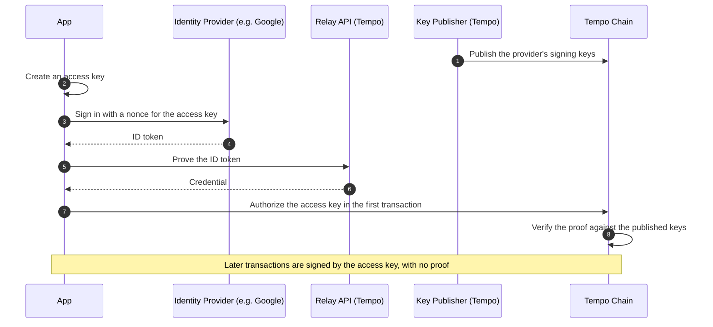

import { Card, Cards } from 'vocs'

# OIDC Signing

## Overview

:::warning
**Experimental.** OIDC signing is experimental and may change in a future release.
It is not yet available on Tempo mainnet or testnet.
:::

OIDC signing lets a sign-in with an identity provider, such as Google, control a Tempo account.
The account holds no key: a zero-knowledge proof of the user's ID token authorizes an access key
on their device, and that access key signs transactions.

The address derives from the user's identity at the provider, your app's OAuth client ID, a secret
salt from the Relay API, and a [Key Publisher](/tempo/actions/keyPublisher.create). The same sign-in
reaches the same address on any device, and the proof reveals the provider but not the user.

[See the OIDC Signers specification](https://tips.sh/1130-1)

### How It Works

A Key Publisher lists the provider's signing keys onchain. When a user signs in, the ID token's
nonce commits to a new access key, and the Relay API proves the token. The proof authorizes the
access key in its first transaction, and later transactions carry no proof.



| Actor | Role | Run By |
| --- | --- | --- |
| App | Creates the access key, signs the user in, and sends transactions with [`oidc.prove`](/tempo/actions/oidc.prove) and [`Account.fromZk`](/tempo/accounts/account.fromZk). | You |
| Identity Provider | Signs the user's ID token. | The provider, such as Google |
| Relay API | Checks ID tokens, derives each user's salt, and proves the sign-in. It can also sponsor the first transaction. | Tempo, or you with [`Relay.oidc`](/tempo/guides/oidc/relay-api) |
| Key Publisher | Lists the provider's signing keys onchain, and keeps them current as they rotate. | Tempo, or you with [`keyPublisher.create`](/tempo/guides/oidc/publish-keys) |
| Tempo Chain | Verifies the proof, authorizes the access key, and runs the transactions. | Validators |

### Trust

The Relay API sees ID tokens and can refuse service, but it cannot sign for users: each token
commits to the access key your app created. The provider can sign in as any of its users.

The Key Publisher owner decides which provider keys the network accepts, so hold the publisher
in a [multisig](/tempo/guides/multisig). A publisher owner cannot affect accounts under other
publishers.

### Usage

Sign the user in, prove the sign-in, and authorize the access key in its first transaction.

:::code-group

```ts twoslash [example.ts]
import { Account, Expiry, WebCryptoP256 } from 'viem/tempo'
import { client } from './viem.config'

// Signs the user in with Google and returns the ID token for `nonce`.
declare function signInWithGoogle(options: { nonce: string }): Promise<string>

// 1. Create an access key on the device.
const keyPair = await WebCryptoP256.createKeyPair()

// 2. Sign in, and prove the sign-in for the access key.
const { credential } = await client.oidc.prove({
  getToken: ({ nonce }) => signInWithGoogle({ nonce }),
  publicKey: keyPair.publicKey,
})

// 3. Instantiate the account and its access key.
const account = Account.fromZk(credential)
const accessKey = Account.fromWebCryptoP256(keyPair, { access: account })

// 4. Authorize the access key in its first transaction.
const keyAuthorization = await account.signKeyAuthorization(accessKey, {
  chainId: BigInt(client.chain.id),
  expiry: Expiry.days(30),
})
const receipt = await client.sendTransactionSync({
  account: accessKey,
  calls: [{ to: '0xcafebabecafebabecafebabecafebabecafebabe' }],
  feePayer: true,
  keyAuthorization,
})
```

```ts twoslash [viem.config.ts (Remote Relay)] filename="viem.config.ts"
// [!include ~/snippets/tempo/oidc.config.ts:remote]
```

```ts twoslash [viem.config.ts (Local Relay)] filename="viem.local.config.ts"
// [!include ~/snippets/tempo/oidc.config.ts:local]
```

:::

## See More

<Cards>
  <Card
    icon="lucide:log-in"
    title="Sign In with an Identity Provider"
    description="Sign users in with Google, prove the sign-in, and authorize an access key."
    to="/tempo/guides/oidc/sign-in"
  />
  <Card
    icon="lucide:key-round"
    title="Publish Provider Keys"
    description="List the provider's signing keys onchain and keep them current as they rotate."
    to="/tempo/guides/oidc/publish-keys"
  />
  <Card
    icon="lucide:server"
    title="Run a Relay API"
    description="Check ID tokens, derive salts, and prove sign-ins with the OIDC relay plugin."
    to="/tempo/guides/oidc/relay-api"
  />
  <Card
    icon="lucide:fingerprint"
    title="Account.fromZk"
    description="The account a proven sign-in controls, and how it authorizes access keys."
    to="/tempo/accounts/account.fromZk"
  />
  <Card
    icon="lucide:book-open"
    title="TIP-1130-1"
    description="Read the specification for OIDC signers on Tempo."
    to="https://tips.sh/1130-1"
  />
</Cards>
