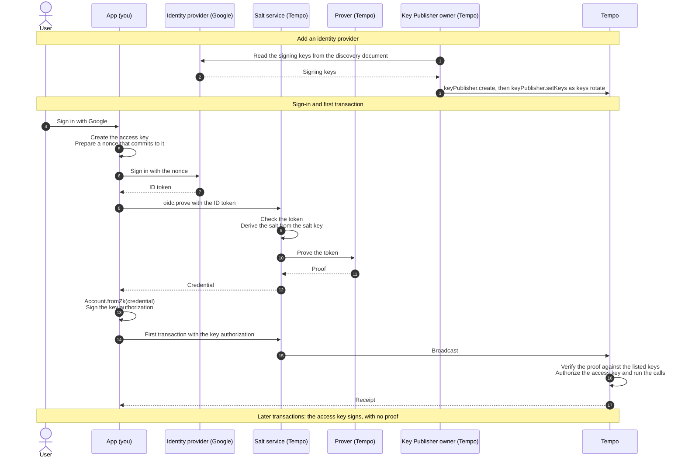

import { Card, Cards } from 'vocs'

# OIDC Sign-In

## Overview

OIDC sign-in turns a sign-in with an identity provider, such as Google, into a Tempo account.
The account holds no key: a zero-knowledge proof of the user's ID token authorizes an access
key on their device, and that access key signs transactions.

The address derives from the user's identity at the provider, your app's OAuth client ID, a
secret salt, and a [Key Publisher](/tempo/actions/keyPublisher.create). The same sign-in reaches
the same address from any device, and the address does not reveal who the user is.

[See the OIDC Signer specification](https://tips.sh/1130)

## How It Works

A Key Publisher lists the provider's signing keys onchain. When a user signs in, the app proves
the ID token through the salt service, and the proof authorizes the app's access key in the
account's first transaction. Later transactions are signed by the access key alone.

## Actors

| Actor | Role | Run by |
| --- | --- | --- |
| App | Creates the access key, signs the user in, and sends transactions with [`oidc.prove`](/tempo/actions/oidc.prove) and [`Account.fromZk`](/tempo/accounts/account.fromZk). | You |
| Identity provider | Signs the user's ID token. | The provider, such as Google |
| Salt service | Checks ID tokens, derives each user's salt, and requests proofs. Its relay also pays the fee of the first transaction. | Tempo, or you with [`Relay.oidc`](/tempo/guides/oidc/salt-service) |
| Prover | Proves the ID token in zero knowledge. | Tempo |
| Key Publisher | Lists the provider's signing keys onchain and keeps them current. | Tempo, or you with [`keyPublisher.create`](/tempo/guides/oidc/publish-keys) |
| Tempo | Verifies the proof, authorizes the access key, and runs the transactions. | Validators |

## See More

<Cards>
  <Card
    icon="lucide:log-in"
    title="Sign In with an Identity Provider"
    description="Sign users in with Google, prove the sign-in, and authorize an access key."
    to="/tempo/guides/oidc/sign-in"
  />
  <Card
    icon="lucide:key-round"
    title="Publish Provider Keys"
    description="List the provider's signing keys onchain and keep them current as they rotate."
    to="/tempo/guides/oidc/publish-keys"
  />
  <Card
    icon="lucide:server"
    title="Run a Salt Service"
    description="Check ID tokens, derive salts, and request proofs with the OIDC relay plugin."
    to="/tempo/guides/oidc/salt-service"
  />
  <Card
    icon="lucide:fingerprint"
    title="Account.fromZk"
    description="The account a proven sign-in controls, and how it authorizes access keys."
    to="/tempo/accounts/account.fromZk"
  />
</Cards>
