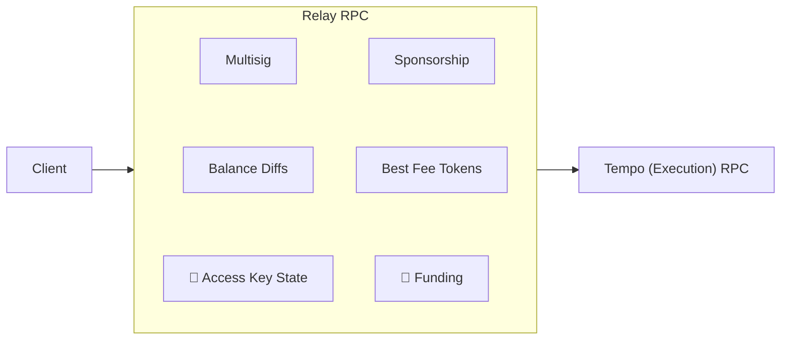

import { Card, Cards } from 'vocs'

# Relay

## Overview

A **Relay** sits between a client and the **Tempo (Execution) RPC**. It acts as a
sidecar to the chain, providing offchain services that are impractical onchain
because of storage growth, cost, or operational requirements.

The node behind the execution RPC executes transactions and enforces authorization.
A Relay prepares transactions and coordinates offchain state; it cannot bypass
chain rules. Clients rely on it for service availability and persistence.

## Plugins

Compose plugins to sponsor transactions, resolve fee tokens, simulate
balance changes, and coordinate multisig approvals. The transaction plugins share
the same middleware contract as custom plugins. Requests enter plugins in array
order, and responses return in reverse order.

Funding and access-key state plugins are planned.

<Cards>
  <Card
    icon="lucide:wallet"
    title="Fee Payer"
    description="Sponsor transaction fees with a local account or an external relay."
    to="/tempo/relay/plugins/fee-payer"
  />
  <Card
    icon="lucide:coins"
    title="Fee Token"
    description="Choose a funded fee token using the sender's preference and balances."
    to="/tempo/relay/plugins/fee-token"
  />
  <Card
    icon="lucide:scan"
    title="Simulate"
    description="Preview token balance changes and estimate fees before sending a transaction."
    to="/tempo/relay/plugins/simulate"
  />
  <Card
    icon="lucide:users"
    title="Multisig"
    description="Coordinate owner approvals and share pending multisig transactions."
    to="/tempo/relay/plugins/multisig"
  />
  <Card
    icon="lucide:key-round"
    title="Key Authorization"
    description="Save signed key authorizations and attach them to the access key's next transaction."
    to="/tempo/relay/plugins/key-authorization"
  />
</Cards>

## See More

<Cards>
  <Card
    icon="lucide:workflow"
    title="Run a Relay"
    description="Host a Fetch endpoint with plugins for transaction preparation and coordination."
    to="/tempo/guides/relay/run"
  />
  <Card
    icon="lucide:network"
    title="Connect to a Relay"
    description="Connect your client to a remote relay or run plugins in your application."
    to="/tempo/guides/relay/connect"
  />
</Cards>
