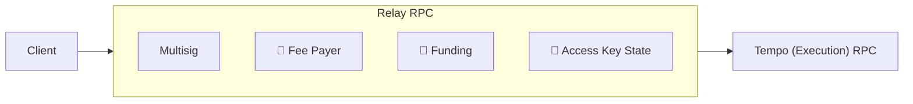

import { Card, Cards } from 'vocs'

# Relay

## Overview

A **Relay** sits between a client and the **Tempo (Execution) RPC**. It acts as a
sidecar to the chain, providing offchain services that are impractical onchain
because of storage growth, cost, or operational requirements.

The node behind the execution RPC executes transactions and enforces authorization.
A Relay prepares transactions and coordinates offchain state; it cannot bypass
chain rules. Clients rely on it for service availability and persistence.

<Cards>
  <Card
    icon="lucide:workflow"
    title="Run a Relay"
    description="Host a Fetch endpoint with a Viem client and plugins."
    to="/tempo/guides/relay/run"
  />
  <Card
    icon="lucide:network"
    title="Connect to a Relay"
    description="Route client requests to a remote relay service."
    to="/tempo/guides/relay/connect"
  />
</Cards>

## Plugins

The first Viem relay plugin coordinates multisig approvals. Fee-payer, funding,
access-key state, and account-config plugins are not implemented here.

The production Tempo Relay API separately provides transaction services such as
fee sponsorship, auto-swap, and fee-token resolution. A Viem relay with the
multisig plugin does not implement those services. Spend routing is a future
direction with similarities to auto-swap.

<Cards>
  <Card
    icon="lucide:users"
    title="Multisig"
    description="Learn how a shared mailbox coordinates owner approvals."
    to="/tempo/relay/plugins/multisig"
  />
</Cards>
