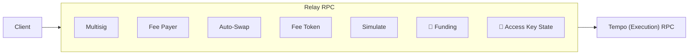

import { Card, Cards } from 'vocs'

# Relay

## Overview

A **Relay** sits between a client and the **Tempo (Execution) RPC**. It acts as a
sidecar to the chain, providing offchain services that are impractical onchain
because of storage growth, cost, or operational requirements.

The node behind the execution RPC executes transactions and enforces authorization.
A Relay prepares transactions and coordinates offchain state; it cannot bypass
chain rules. Clients rely on it for service availability and persistence.

<Cards>
  <Card
    icon="lucide:workflow"
    title="Run a Relay"
    description="Host a Fetch endpoint with a Viem client and plugins."
    to="/tempo/guides/relay/run"
  />
  <Card
    icon="lucide:network"
    title="Connect to a Relay"
    description="Route client requests to a remote relay service."
    to="/tempo/guides/relay/connect"
  />
</Cards>

## Plugins

Compose plugins to sponsor transactions, resolve fee tokens, add swaps, simulate
balance changes, and coordinate multisig approvals. The transaction plugins share
the same middleware contract as custom plugins. Requests enter plugins in array
order, and responses return in reverse order.

Funding and access-key state plugins are planned.

<Cards>
  <Card
    icon="lucide:users"
    title="Multisig"
    description="Learn how a shared mailbox coordinates owner approvals."
    to="/tempo/relay/plugins/multisig"
  />
  <Card
    icon="lucide:wallet"
    title="Fee Payer"
    description="Sponsor transaction fees."
    to="/tempo/relay/plugins/fee-payer"
  />
  <Card
    icon="lucide:arrow-left-right"
    title="Auto-Swap"
    description="Swap held tokens to cover a missing balance."
    to="/tempo/relay/plugins/auto-swap"
  />
  <Card
    icon="lucide:coins"
    title="Fee Token"
    description="Select a fee token the sender holds."
    to="/tempo/relay/plugins/fee-token"
  />
  <Card
    icon="lucide:scan"
    title="Simulate"
    description="Preview balance changes and estimated fees."
    to="/tempo/relay/plugins/simulate"
  />
</Cards>
