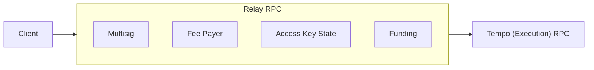

import { Card, Cards } from 'vocs'

# Relay

## Overview

A **Relay** sits between a client and the **Tempo (Execution) RPC**. It acts as a
sidecar to the chain, providing offchain services that are impractical onchain
because of storage growth, cost, or operational requirements.



The node behind the execution RPC executes transactions and enforces authorization.
A Relay prepares transactions and coordinates offchain state; it cannot bypass
chain rules. Clients rely on it for service availability and persistence.

## Usage

Connect to a remote Relay with [`withRelay`](/tempo/transports/withRelay). To
implement relay behavior, use [`Relay.handleRequest`](/tempo/utilities/Relay.handleRequest)
to compose plugins around a downstream handler. With no plugins, requests pass
directly to the execution RPC.

```ts twoslash
import { http } from 'viem'
import { Relay } from 'viem/tempo'

const rpc = http('https://rpc.tempo.xyz')({})
const handle = Relay.handleRequest(rpc.request)

const chainId = await handle({ method: 'eth_chainId' })
// @log: '0x1079'
```

:::warning
**Experimental.** This module composes handlers, not a complete relay service.
Your application provides HTTP hosting, authentication, and persistent storage.
:::

<Cards>
  <Card
    icon="lucide:workflow"
    title="Handle Requests"
    description="Compose plugins around a downstream RPC handler."
    to="/tempo/utilities/Relay.handleRequest"
  />
  <Card
    icon="lucide:network"
    title="Connect to a Relay"
    description="Route client requests to a remote relay service."
    to="/tempo/transports/withRelay"
  />
</Cards>

## Plugins

Plugins extend a Relay with offchain services such as Multisig, Fee Payer,
Access Key State, and Funding. Each plugin handles its own requests and passes
other methods to the next handler in the pipeline.

<Cards>
  <Card
    icon="lucide:users"
    title="Multisig"
    description="Learn how a shared mailbox coordinates owner approvals."
    to="/tempo/utilities/Multisig"
  />
</Cards>
